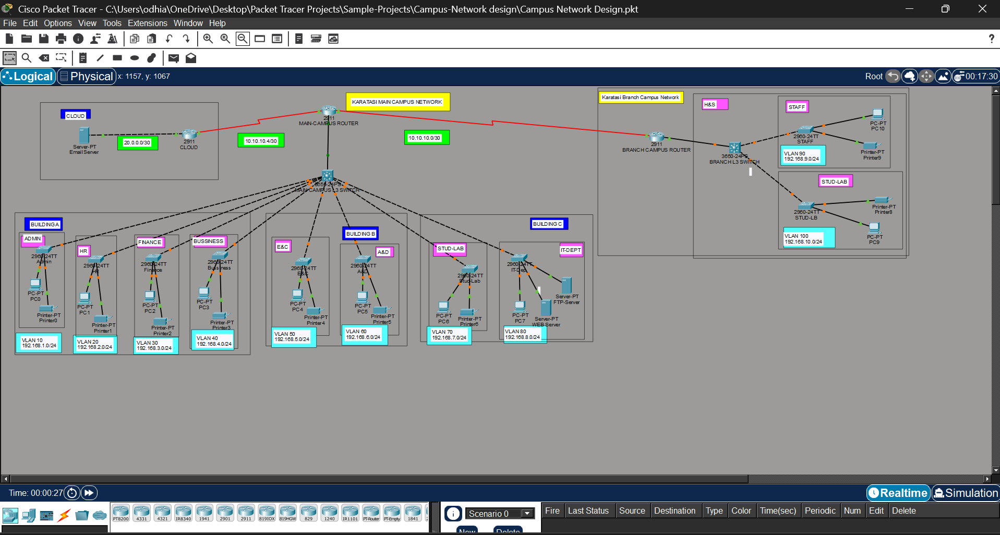

# Karatasi University Campus Network Design



## Project Overview

This Cisco Packet Tracer project models the network for **Karatasi University**, a distributed institution with a main campus, a branch campus, and an external cloud email service. The design demonstrates campus network segmentation, inter-VLAN routing, dynamic routing, router-based DHCP, WAN connectivity, and internal application servers.

The main campus is divided into three buildings. A point-to-point WAN link connects it to the Karatasi branch campus, while a second point-to-point link provides reachability to the external email server.

### Project goals

- Separate university departments into dedicated VLANs and IPv4 subnets.
- Provide reliable default gateways and automatic addressing for client devices.
- Route traffic between departments and campuses.
- Host internal web and FTP services in the IT/server VLAN.
- Provide a simulated external email service through the cloud segment.
- Provide a Packet Tracer environment for configuration practice and connectivity testing.

## Topology

```text
                                +----------------------+
                                | Cloud Email Network  |
                                | Email Server         |
                                +----------+-----------+
                                           |
                                  20.0.0.0/30 WAN
                                           |
                         +-----------------+-----------------+
                         | MAIN-CAMPUS ROUTER (2911)         |
                         +-----------------+-----------------+
                                           |
                                  10.10.10.0/30 WAN
                                           |
                         +-----------------+-----------------+
                         | BRANCH-CAMPUS ROUTER (2911)       |
                         +-----------------+-----------------+
                                           |
                              BRANCH L3 SWITCH (3560)
                               /                    \
                    Staff VLAN 90              Student VLAN 100
                    192.168.9.0/24              192.168.10.0/24

                         MAIN-CAMPUS L3 SWITCH (3560)
                              /          |          \
                     Building A      Building B    Building C
                  VLANs 10-40       VLANs 50-60    VLANs 70-80
```

### Main campus

The main campus router connects the campus LAN to the branch WAN and the external cloud WAN. A multilayer switch provides the campus distribution point and connects the three building networks:

- **Building A:** Administration, HR, Finance, and Business.
- **Building B:** Engineering and Computing, and Art and Design.
- **Building C:** Student Labs and IT. The IT segment contains the internal web and FTP servers.

### Branch campus

The branch campus contains Health and Sciences staff devices and a student laboratory. A branch router connects the site to the main campus, and a branch multilayer switch distributes the two branch VLANs.

### External cloud

The cloud segment contains the university email server. It is connected to the main campus router through a dedicated point-to-point network.

## Network Devices

| Device or group | Type shown in topology | Purpose |
| --- | --- | --- |
| Main campus router | Cisco 2911 | WAN connectivity and campus routing |
| Main campus switch | Cisco 3560 multilayer switch | VLAN aggregation and Layer 3 campus switching |
| Branch campus router | Cisco 2911 | WAN connectivity for the branch campus |
| Branch campus switch | Cisco 3560 multilayer switch | Branch VLAN aggregation and routing |
| Department switches | Cisco 2960-24TT | Access-layer connectivity for users and printers |
| Internal servers | Server-PT | Web and FTP services in the IT VLAN |
| Cloud email server | Server-PT | External email service simulation |
| End devices | PC-PT and Printer-PT | Department clients and printing endpoints |

The exact interface-to-device mapping is stored in `Campus Network Design.pkt`. Use the Packet Tracer labels and `show cdp neighbors` or `show ip interface brief` to confirm interfaces before changing the topology.

## VLAN and IPv4 Addressing Plan

All department networks use a `/24` subnet. The `.1` address is reserved as the documented default gateway. Client addresses may be assigned dynamically through DHCP.

| Location | Department | VLAN | Network | Default gateway |
| --- | --- | ---: | --- | --- |
| Building A | Administration | 10 | `192.168.1.0/24` | `192.168.1.1` |
| Building A | HR | 20 | `192.168.2.0/24` | `192.168.2.1` |
| Building A | Finance | 30 | `192.168.3.0/24` | `192.168.3.1` |
| Building A | Business | 40 | `192.168.4.0/24` | `192.168.4.1` |
| Building B | Engineering and Computing | 50 | `192.168.5.0/24` | `192.168.5.1` |
| Building B | Art and Design | 60 | `192.168.6.0/24` | `192.168.6.1` |
| Building C | Student Labs | 70 | `192.168.7.0/24` | `192.168.7.1` |
| Building C | IT and internal servers | 80 | `192.168.8.0/24` | `192.168.8.1` |
| Branch campus | Health and Sciences staff | 90 | `192.168.9.0/24` | `192.168.9.1` |
| Branch campus | Student Labs | 100 | `192.168.10.0/24` | `192.168.10.1` |

### Point-to-point networks

| Connection | Network | Purpose |
| --- | --- | --- |
| Main campus to branch campus | `10.10.10.0/30` | Inter-campus WAN link |
| Main campus to cloud | `10.10.10.4/30` | External email-server link |
| Cloud-side service network shown in topology | `20.0.0.0/30` | Cloud email reachability |

The screenshot labels both the main-to-cloud path and the cloud service segment. Confirm the actual IP address assigned to each router and server interface in the Packet Tracer file before applying a static route.

## How the Design Works

1. Each department connects end devices to access ports assigned to its department VLAN.
2. Uplinks between access switches and the multilayer switch carry the required VLANs using 802.1Q trunking where configured.
3. The Layer 3 gateway for each VLAN routes traffic between local departments.
4. Router-based DHCP pools provide client addresses, masks, default gateways, and DNS settings.
5. RIPv2 advertises the internal LAN and WAN networks across the inter-campus path, subject to the networks configured in the `.pkt` file.
6. A route to the cloud network provides reachability to the external email server.
7. The IT VLAN provides a separate location for the internal web and FTP servers.

## Configuration Reference

The commands below are representative templates. Interface names, routing protocol networks, and cloud next-hop addresses must match the saved Packet Tracer configuration.

### 1. Create a VLAN and gateway on a multilayer switch

```text
Switch> enable
Switch# configure terminal
Switch(config)# ip routing
Switch(config)# vlan 10
Switch(config-vlan)# name ADMIN
Switch(config-vlan)# exit
Switch(config)# interface vlan 10
Switch(config-if)# ip address 192.168.1.1 255.255.255.0
Switch(config-if)# no shutdown
Switch(config-if)# exit
```

Repeat the pattern for VLANs 20, 30, 40, 50, 60, 70, 80, 90, and 100 using the addressing table above.

### 2. Configure an access port and trunk uplink

```text
Switch(config)# interface FastEthernet0/1
Switch(config-if)# switchport mode access
Switch(config-if)# switchport access vlan 10
Switch(config-if)# no shutdown
Switch(config-if)# exit
Switch(config)# interface GigabitEthernet0/1
Switch(config-if)# switchport mode trunk
Switch(config-if)# no shutdown
Switch(config-if)# exit
```

Assign each user-facing port to the VLAN for its department. Use the actual uplink interface shown in the topology for trunk configuration.

### 3. Configure router-based DHCP

```text
Router(config)# ip dhcp excluded-address 192.168.1.1 192.168.1.10
Router(config)# ip dhcp pool ADMIN_POOL
Router(dhcp-config)# network 192.168.1.0 255.255.255.0
Router(dhcp-config)# default-router 192.168.1.1
Router(dhcp-config)# dns-server 8.8.8.8
Router(dhcp-config)# exit
```

Create one pool per client VLAN. Exclude gateway, server, printer, and other infrastructure addresses so DHCP cannot assign them to clients.

### 4. Configure RIPv2

```text
Router(config)# router rip
Router(config-router)# version 2
Router(config-router)# no auto-summary
Router(config-router)# network 192.168.1.0
Router(config-router)# network 192.168.2.0
Router(config-router)# network 10.10.10.0
Router(config-router)# exit
```

Add every directly connected LAN and WAN network required by that router. Do not copy the example blindly: the main router, branch router, and cloud router advertise different connected networks.

### 5. Configure a route to the cloud service

If the cloud network is not learned dynamically, add a static route using the real next-hop address or exit interface from the Packet Tracer file:

```text
Router(config)# ip route 20.0.0.0 255.255.255.252 <next-hop-or-exit-interface>
```

The placeholder is intentional. Replacing it with an incorrect interface or next hop can create a route that appears in the table but does not forward traffic.

### 6. Save the configuration

```text
Router# copy running-config startup-config
Switch# copy running-config startup-config
```

## Verification and Test Plan

Run the following checks after opening the project or making configuration changes.

| Area | Command or action | Expected result |
| --- | --- | --- |
| Interfaces | `show ip interface brief` | Required interfaces are up/up with expected addresses |
| VLANs | `show vlan brief` | Access ports are assigned to the intended VLANs |
| Trunks | `show interfaces trunk` | Uplinks are trunking and carry required VLANs |
| Layer 3 gateways | `show ip interface brief` and ping each gateway | Each SVI or routed gateway responds |
| DHCP | Set a client to DHCP, then use `ipconfig` | Client receives an address from the correct subnet |
| DHCP leases | `show ip dhcp binding` | Active leases appear in expected pools |
| Routing | `show ip route` | Local, remote, RIP, and cloud routes are present as designed |
| RIPv2 | `show ip protocols` | RIPv2 is enabled and expected networks are advertised |
| End-to-end LAN | Ping between two main-campus VLANs | Traffic crosses the Layer 3 gateway successfully |
| Inter-campus WAN | Ping a branch gateway or client from the main campus | Traffic crosses the `10.10.10.0/30` link |
| Services | Use a browser or FTP client against the internal servers | Web and FTP services respond from the IT VLAN |
| Cloud reachability | Ping or access the configured email server | Cloud path and return route are working |

For a systematic test, begin with the local gateway, then test another VLAN in the same campus, then the remote campus, and finally the cloud service. This identifies the first failing network boundary instead of treating every failed ping as the same problem.

## Troubleshooting

- **Client has no IP address:** Check the access VLAN, DHCP pool network, excluded addresses, trunk state, and the client configuration mode.
- **Client reaches its gateway but not another VLAN:** Check that the destination SVI exists, is up, and has the expected subnet; then inspect `show ip route`.
- **Main campus cannot reach the branch:** Check both WAN interfaces, `/30` addresses, serial line status, RIPv2 network statements, and any required clock rate on the DCE side.
- **RIPv2 routes are missing:** Confirm `version 2`, `no auto-summary`, correct `network` statements, and that the neighbor-facing interface is active.
- **Cloud server is unreachable:** Verify the cloud-side address, the route to the correct cloud network, the next hop, and the server's default gateway.
- **Web or FTP access fails:** Confirm the server is in VLAN 80, has a valid gateway, and has the relevant Packet Tracer service enabled.
- **Only some devices fail:** Check the specific access-port VLAN and cable/link status before changing routing.

## Critical Evaluation of the Network Design

### Performance

The architecture follows a hierarchical campus design, with a multilayer Layer 3 switch at the main campus providing inter-VLAN routing close to the access networks. This reduces the need to send local department traffic through the WAN router and supports efficient forwarding within the campus. RIPv2 provides automatic route exchange across the WAN, which is suitable for this teaching and simulation environment. However, RIPv2 has slower convergence and a smaller routing metric limit than link-state protocols such as OSPF, so it would be less suitable as the university network grows substantially.

### Scalability

VLAN segmentation isolates departmental broadcast domains and allows Buildings A, B, and C to be expanded independently. The structured `/24` allocation gives each department ample address space for additional workstations, printers, and other endpoints. The consistent VLAN and gateway scheme also makes it straightforward to add new access ports or departments. As the network grows, the flat `/24` allocation should be reviewed so that address space is not wasted and route summarization remains practical.

### Reliability

The design provides dedicated WAN connectivity between the main and branch campuses and a separate path toward the external cloud email service. These links separate major network functions and allow the sites to exchange routes dynamically. The current topology nevertheless contains single points of failure at the main campus multilayer switch and primary router. A failure of either device could interrupt connectivity for a large portion of the university. Future iterations should introduce redundant core hardware, alternative WAN paths, and Hot Standby Router Protocol (HSRP) or an equivalent first-hop redundancy mechanism.

### Security

VLANs logically separate sensitive administrative traffic, including Administration and HR on VLANs 10 and 20, from student laboratory traffic on VLANs 70 and 100. This segmentation limits broadcast exposure, but VLAN separation alone does not enforce access control between routed networks. Access Control Lists (ACLs) should therefore be deployed on the routing devices to restrict student access to Finance, HR, Administration, IT, and server subnets while allowing only the services that students require. Additional protections such as SSH administration, switch port security, unused-port shutdown, and service-specific firewall policies would strengthen the design.

## Opening the Project

1. Install [Cisco Packet Tracer](https://www.netacad.com/courses/packet-tracer).
2. Open `Campus Network Design.pkt` from this directory.
3. Start in Logical view and review the device labels, VLAN annotations, and WAN networks.
4. Inspect the running configuration of the routers and multilayer switches before making changes.
5. Run the verification plan above and save the file under a new name if you are experimenting.

## Repository Contents

| Path | Description |
| --- | --- |
| `Campus Network Design.pkt` | Cisco Packet Tracer topology and device configurations |
| `screenshots/topology.png` | Exported topology overview |
| `README.md` | Project documentation, addressing plan, and test procedures |

## Security and Design Limitations

This is a learning and simulation project, not a production-ready university network. The current design should be strengthened before real deployment:

- Add ACLs to limit student access to administrative, Finance, HR, and server networks.
- Add switch port security, unused-port shutdown, management VLAN controls, and secure device administration with SSH.
- Replace simple or shared lab credentials with centralized authentication and unique secrets.
- Protect the email, web, and FTP services with appropriate firewall rules and current protocols.
- Add redundant WAN links, gateway redundancy, and monitoring for higher availability.
- Use a production routing design with clear route summarization and documented failover behavior.
- Add a formal IP address reservation table for servers, printers, switches, routers, and access points.

## Future Enhancements

1. Implement ACL policies by department and document the permitted traffic matrix.
2. Add redundant paths between the main and branch campuses.
3. Introduce centralized DNS, NTP, logging, and network monitoring.
4. Replace FTP with a secure file-transfer service for any real deployment.
5. Add wireless access with documented SSIDs, authentication, and guest isolation.
6. Create Packet Tracer test scenarios for link failure, DHCP failure, and unauthorized access.
